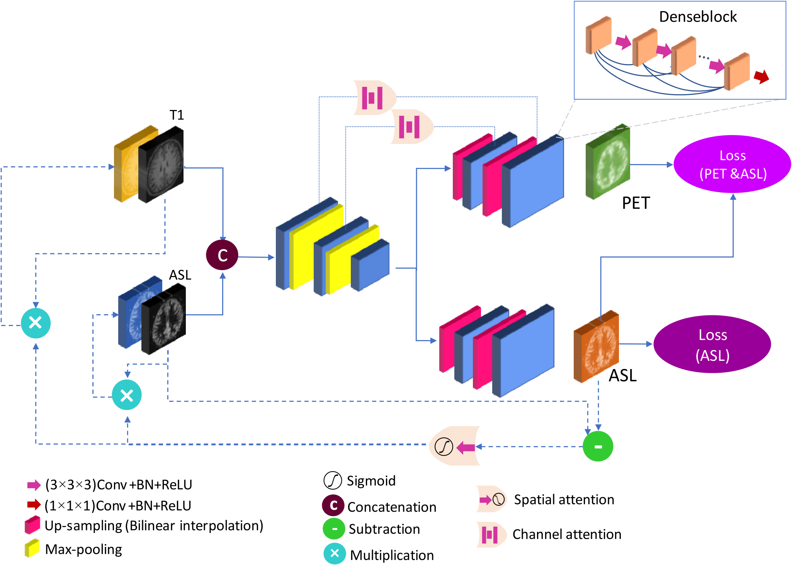

# ASL_PET_translation

In this project the inputs are the ASL and T1 scans and the output is a PET scan

# Proposed CNN

    
    <em>Figure 1- proposed network.</em>

# Requirments

Tensorflow<2 & python>3.4

If this repository helps you in anyway, show your love :heart: by putting a :star: on this project 
